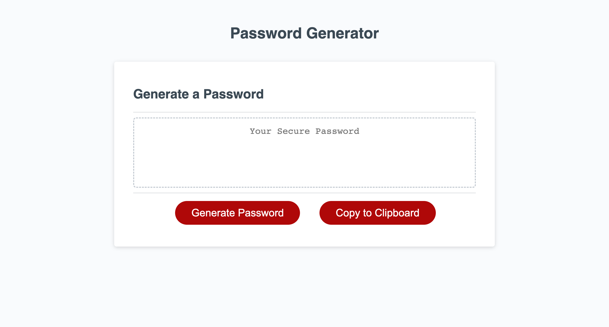

# Module 3 Challenge: Password Generator
This project allows the user to generate a password based on prompted criteria and also allows user to copy it to the clipboard for convenience.

This project is emphasized on the use of JavaScript to create a randomly generated secure password for the user.

## <u>Table of Contents</u>
1. [Link to Deployed Page](#udeployed-pageu)
2. [Webpage Features](#uwebpage-featuresu)
3. [Screenshot](#uscreenshotu)
4. [Sources](#usources-u)

## <u>Deployed Page</u>

## <u>Webpage Features</u>
- The user can choose the password length from 8 to 128. If a number outside the range is chosen or a letter is typed in, it will later on alert an error and restart the process.
- The webpage will generate a password according to the user's character type choices. When the user chooses none, it will alert an error and restart the process.
- The user can copy the password into the clipboard for convenience. The webpage will then alert that the password has been copied.
- The prompted criteria are stored in an object before being sent to a function that generates the actual password.

## <u>Screenshot</u>

## <u>Sources </u>
1. https://www.w3schools.com/
2. https://techozu.com/clipboard-api-domexception-javascript-fix/
